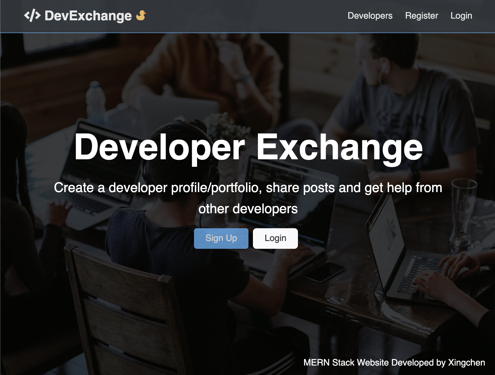
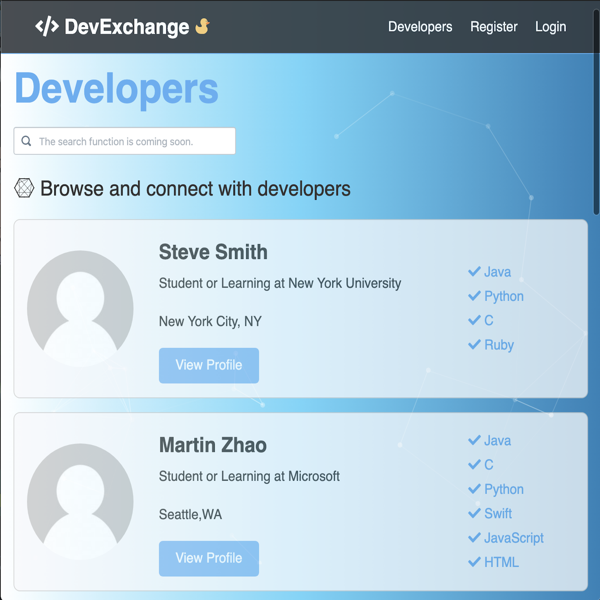

<div class="ui small rounded images">
  
  
</div>

# DevExchange (might be a little slow to load)
> A small social network for developers 
> * https://devexchange.herokuapp.com (might be a little bit to load)
> * https://github.com/xingchenzhao/DevExchange
* This is an in depth full stack(MERN Stack) social network application(DevExchange) using Node.js, Express, React, Redux and MongoDB along with ES6+.

## Personal Side Project
* Building an extensive backend API with Node.js & Express
* Protecting routes/endpoints with JWT (JSON Web Tokens)
* Extensive API testing with Postman
* Integrating React with the backend in an elegant way, creating a great workflow
* Building the frontend to work with API
* Using Redux for app state management
* Creating reducers and actions for the resoureces
* Creating many container components that integrate with Redux
* Testing with the Redux Chrome extension
* Creating a build script, securing the keys and deploy to Heroku using git.

## Quick Start

```
#change default.json file (config/default.json)
#add uri of your own mongodb connection. For example "mongoURI": " mongodb://localhost/dev-exchange"
```

```bash
# Install server dependencies
npm install

# Install client dependencies
cd client
npm install

# Run both Express & React from root
npm run dev

# Build for production
cd client
npm run build
```


